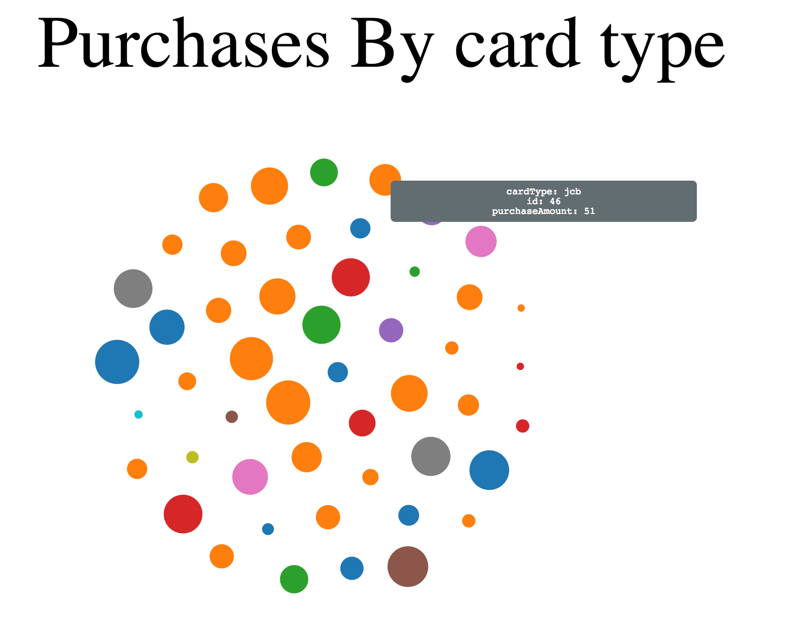

# Iman Baghai

# Bubbles plot



This is an example of the bubble graph created by the bubbles.js api.

This type of graph in the example has purchases with dot sizes relative to the size of the purchase amount and the dots colors are determined by the credit card type used to make purchase. By hovering over a dot you can get more details like card type, the order id, and the purchase amount. This graph also allows for the changing of how close or far you want the dots to be with one another.

This is a good graph if you have categorical information you want to break out into groups and gain characteristics for each single input as well.

In this example the data in this example is structured as is:


| id        | cardType           | PurchaseAmount  |
| ------------- |:-------------:| :-----:|
| 1   | visa | 20 |
| 2    | mastercard  | 12 |
| 3 | visa      |    10 |

In this data set you can set the how you want the colors of the dots to be grouped by, what data should be used to create dot sizes, and a data id. Currently, the chart is designed to support three main columns of data that this chart can support. Or more technically speaking it is preferable to have your data in a long format rather than a wide format.

To create this chart do the following:

- Load your data
- create  ```chart variable``` calling ```bubbles``` and passing in parameters and specifications as needed and desired
- call your ```chart variable``` into a div that'd you like passing in your data and ```call``` your ```chart``` variable

visual skeleton example:

```var myChart = chart().param1(value1).param2(value2);```

```var chartWrapper = d3.select('#my-div').datum([dataSet]).call(myChart);```


Here is a table of methods for the API that can be called on the ```bubbles``` function that can be passed into myChart to set it up accordingly

## Bubbles methods


| Method        | Input + example        | Output  
| ------------- |:-------------:| :-----:|
| chart.width   | integer, chart.width(500) | set width of chart |
| chart.height  | integer, chart.height(500)  | set height of chart|
| chart.range | array of 2 integers, chart.range([10,30])      |    set range of min and max size of bubbles|
| chart.columnForColors| String, chart.columnForColors('cardType') | Sets column of data for grouping of bubble colors and hover on features |
| chart.columnForRadius | string,  chart.columnForRadius('purchaseAmount')| sets column for setting bubble size and features for hover on display  |
|chart.title | string, chart.title('title') | Sets title for graph |
|chart.identifer| string, chart.identifer('id') | sets up another descriptor for hover over from column of data |
|chart.strength | integer (recommend >0 #s ), chart.strength(-100) | sets the power in which the bubbles repel off on another to add more or less spacing between them |


link to an [example](http://staff.washington.edu/ibaghai/info474_A3ex/bubbles.html)
